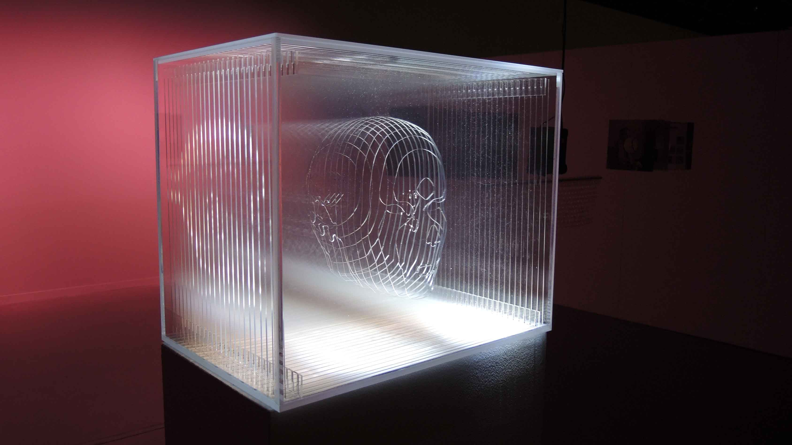

# La partition des corps

http://www.manuelchantre.com/fr/la-partition-des-corps/

## L'auteur

**Programmation multimédia, design 3D, production** : Manuel Chantre

**Équipe qui a participé à la création de l'installation** : Rick Lespérance, Jean-François Meilleur, Alexandre Pierre-Louis

## Date et lieu

**Date de présentation** : 26 avril au 4 juin 2017

**Visites commentées** : 29 avril et 6 mai 2017

**Exhibition** :  Centre d’art Diane-Dufresne, Repentigny

## Description de l'oeuvre

> "Je souhaite que les musiques provoquent le rappel de souvenirs associés à ces musiques. Des souvenirs qui appartiennent au public, au visage transparent et aux anciens propriétaires de vinyls"   *Manuel Chantre*

  
L’œuvre est constituée de quarante disques de vinyls trouvés, puis troués et supsendus au plafond à compagnie d'haut-parleurs.

Au centre de l'exposition, la sculpture d'une tête transparente trône, composée de plusieurs couches.

Des papiers à bulle se sutie dessous les 40 vinyles et haut-parleurs. C'est là que l'interactivité s'établit. Les visiteurs sont alors encouragés à éclater les bulles. De cet acte, ils déclenchent la musique qui provient de différentes époques. Avec les gestes de tous les visiteurs, une harmonie musicale se crée dans la pièce.

### L'intention de l'auteur

Chantre souhaite transmettre un sentiment de nostalgie au public à travers la musique, « une réflexion sur le temps qui passe ». Il souhaite aussi faire revivre notre jeunesse intérieure avec la sensation satisfaisante du papier plastique qui éclate et les mélodies de nos enfances. Il croit que la musique est plus qu'un média de divertissement, elle nous permet d'exprimer nos émotions et nous faire rappeler des souvenirs. 

### Public cible

Cette oeuvre vise à cibler les adultes, principalement ceux nés à l'âge du disque vinyl, autour des années 60-70. 

### Processus de création

L'oeuvre a été développée à partir de vieux vinyls que Chantre a trouvé, posés en bordure de la route pour les donner.

### Aspects techniques
**L'installation**
- Vinyls (rouge, mauve, orange, jaune)
- Ordinateur
- Logiciel interactif multimédia
- Arylique, bois, nylon, lumière, papier bulle
- Haut-parleurs et microphones.

Dimensions: 13 x 10 x 3 mètres / 40 X 31 X 9 pieds

**La sculpture**
- Acrylique

Dimensions: 50 x 33 x 40.5 cm / 19 x 13 x 16 pouces

## La composante centrale

L'élément clé qui caractérise cette oeuvre, c'est l'interaction du public avec le papier à bulle, qui active le son des vinyls. Chantre explique que cette interaction est [« [...] un geste drôle, violent et naïf en même temps »](http://www.manuelchantre.com/wp-content/uploads/2018/02/l-art-de-la-musi.pdf) . Elle reproduit notre nostalgie et curiosité de l'enfance. C'est un geste aussi satisfaisant qui contribue alors à l'engagement du public. Le papier à bulle est un élément original de l'oeuvre qui vise à remplacer l'interupteur qu'on rencontre souvent. De ce fait, cela se démarque de ce qu'on voit communément dans les oeuvres multimédias.

## Appréciation personnelle

J'ai choisi cette oeuvre dès que j'ai remarqué l'intégration de la musique. Je peux m'identifier avec cet aspect, car la musique est un média que j'apprécie énormément et qui influence profondément mes émotions. De plus, j'aime beaucoup l'oeuvre puisque qu'elle intègre de nombreux éléments originaux. Par exemple, le papier à bulle pour activer le son et le mélange innovant de différentes techniques, telles que la sculpture acrylique, l'interactivité sonore et le projet de type DIY avec les vinyls. Le message transmit par l'œuvre est également très beau et inspirant.
